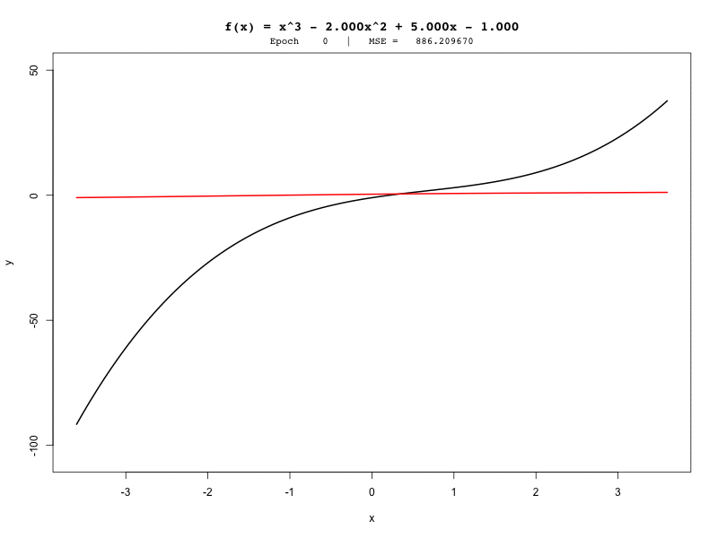
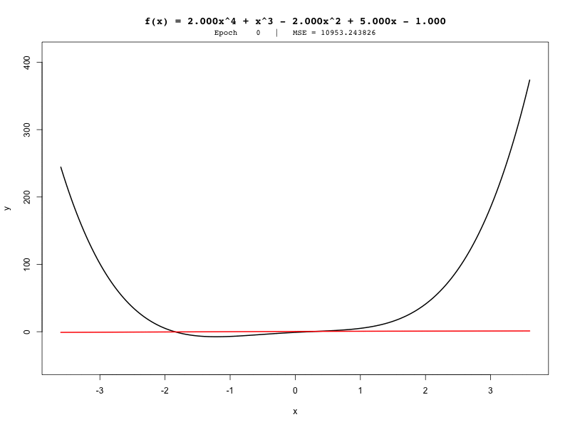
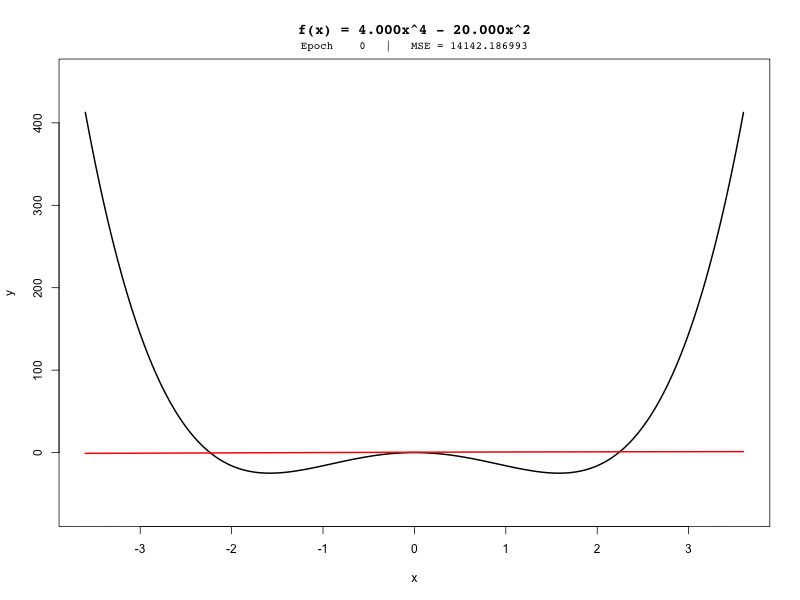

# Polynomial Prediction Visualizations

This folder contains visualizations of polynomial predictions from neural networks trained using the **Bootstrap Learning Algorithm**. The GIFs show how the predicted polynomial curves evolve during training epochs.

## Cubic Polynomials

Predictions for cubic polynomials over training:

## Quartic Polynomials

Predictions for quartic polynomials over training:

